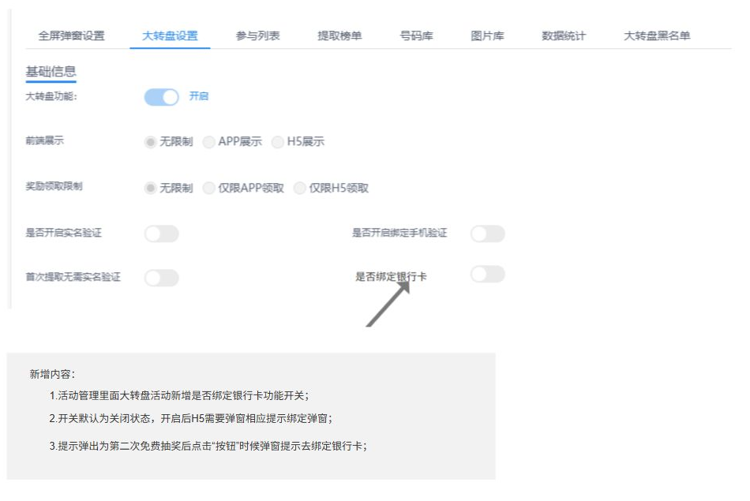

# 大转盘优化

- 文档名称：大转盘优化
- 文档版本：2026-10-07
- 来源：大转盘优化.docx
- 解析时间：2026-10-07 13:28
- 解析工具：MinerU 4.0.10（flash 本地解析）+ docx 原生结构逐块核对
- 页数：1 图数：2

---

本文档整理自两个 Axure 原型页面，内容包括活动管理端新增的“是否绑定银行卡”配置项，以及 H5 端绑定银行卡弹窗的文案与交互说明，供评审与开发参考。

| 原型页面 1 | Page 1（活动管理 - 大转盘设置）：新增“是否绑定银行卡”开关 |
| --- | --- |
| 原型页面 2 | H5页面：绑定银行卡弹窗提示 |
| 整理日期 | 2026年10月7日 |

[转录备注：原表为两列信息表，无表头行；此处按 Markdown 表格语法以首行作为表头渲染。]

**原型链接**

Page 1：https://ce9g6h.axshare.com/?g=14&id=klp8kv&p=page_1

H5页面：https://ce9g6h.axshare.com/?g=14&id=7q6ab2&p=h5%E9%A1%B5%E9%9D%A2

## 一、活动管理端新增内容

大转盘设置页的“基础信息”区域新增“是否绑定银行卡”开关，位置在“首次提取无需实名验证”右侧，与“是否开启实名验证”“是否开启绑定手机验证”同属一行区域，开关默认为关闭状态。

图 1 活动管理 - 大转盘设置：新增“是否绑定银行卡”开关（截自原型 Page 1）

**原型原文：**

- 活动管理里面大转盘活动新增是否绑定银行卡功能开关；
- 开关默认为关闭状态，开启后H5需要弹窗相应提示绑定弹窗；
- 提示弹出为第二次免费抽奖后点击“按钮”时候弹窗提示去绑定银行卡；

## 二、H5 端绑定银行卡弹窗

H5 页面在免费抽奖场景中新增绑定银行卡弹窗，使用通用弹窗样式，包含提示文案、主按钮与关闭入口。

图 2 H5 绑定银行卡弹窗：含“去绑定”按钮与右上角关闭“X”（截自原型 H5页面）

**弹窗内容：**

- 弹窗标题：提示
- 提示文案：恭喜你获得提现资格，为方便您快速提现，请绑定银行卡
- 主按钮：去绑定（点击跳转到绑定银行卡页面，页面使用通用弹窗）
- 关闭按钮：右上角“X”（点击关闭弹窗，返回原页面）

**原型原文：**

- H5新增绑定银行卡弹窗提示，点击去绑定跳转到绑定银行卡页面，页面使用通用弹窗；
- 提示弹出为第二次免费抽奖后点击“按钮”时候弹窗提示去绑定银行卡；
- 点击x号，关闭弹窗返回原页面，再次操作继续弹窗提示；

## 三、需求要点汇总

| 序号 | 需求点 | 说明 |
| --- | --- | --- |
| 1 | 新增“是否绑定银行卡”开关 | 位于活动管理 - 大转盘设置 - 基础信息区域，默认关闭。 |
| 2 | 弹窗触发条件 | 开关开启后，H5 端在第二次免费抽奖后点击按钮时弹出绑定银行卡提示。 |
| 3 | 弹窗样式与文案 | 使用通用弹窗；标题为“提示”；文案为“恭喜你获得提现资格，为方便您快速提现，请绑定银行卡”；主按钮为“去绑定”；右上角为关闭“X”。 |
| 4 | 点击“去绑定” | 跳转到绑定银行卡页面。 |
| 5 | 点击关闭“X” | 关闭弹窗并返回原页面，再次操作仍会弹出提示。 |

## 四、待确认事项

- “第二次免费抽奖后点击‘按钮’”中按钮的具体名称与位置，原型原文仅表述为“按钮”。
- 开关关闭时的行为：不弹出绑定银行卡提示弹窗（按“开关默认为关闭状态”推断，需确认）。
- 弹窗是否需要判断用户是否已绑定银行卡，已绑定用户是否仍弹出提示。
- 该开关与弹窗是否影响 APP 端，原型页面仅说明 H5 端。
